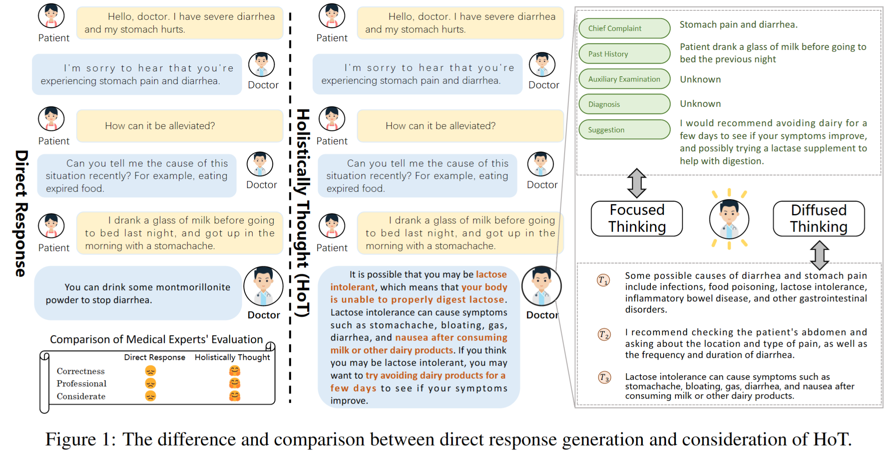
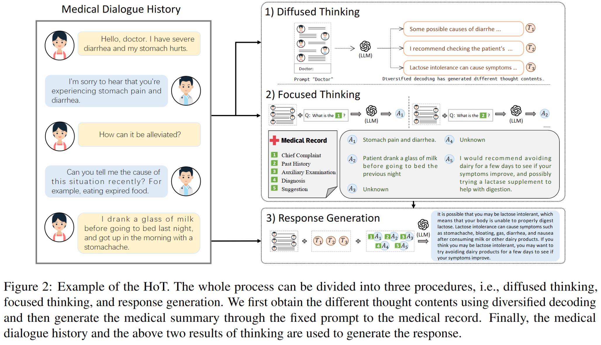

# Large Language Models Need Holistically Thought in Medical Conversational QA

This is the official implementation of `Large Language Models Need Holistically Thought in Medical Conversational QA`.



## Installation
Make sure you have Python>=3.8 installed on your machine.
```
pip install torch==1.8.2+cu111 torchtext==0.9.2 -f https://download.pytorch.org/whl/lts/1.8/torch_lts.html
pip install tqdm transformers sklearn pandas numpy sentencepiece openai
```

## Set your OpenAI API key
```
# https://beta.openai.com/account/api-keys
export OPENAI_API_KEY=(YOUR OPENAI API KEY)
```

## Set arguments.
```
model=CODEX # {"codex", "codex-001","GLM"}. "codex" is the smallest model.
dataset=multiarith # We can use other datasets. See help for the details.
api_time_interval=4.0 # Caution. The API allows users request API up to 20 times in a minutes, otherwise errors happen.
```

## Quick Start

### HoT (our proposal)
```
python main.py --method=verifier_cot --model=${model} --dataset=${dataset}
```

### CoT
```
# MultiArith and MedDialog are currently available.
python main.py --method=zero_shot_cot --model=${model} --dataset=${dataset}
```


## Method




## How to use GLM

The specific process is in [Github]([GLM-130B/inference-with-fastertransformer.md at main · THUDM/GLM-130B (github.com)](https://github.com/THUDM/GLM-130B/blob/main/docs/inference-with-fastertransformer.md)).

After we successfully load GLM in the server, we input the GLM api.

```
# Use GLM
python main.py --method=hot --model=GLM --dataset=${dataset} --GLM_API='xxx.xxx.xxx.xxx:5000'
```

